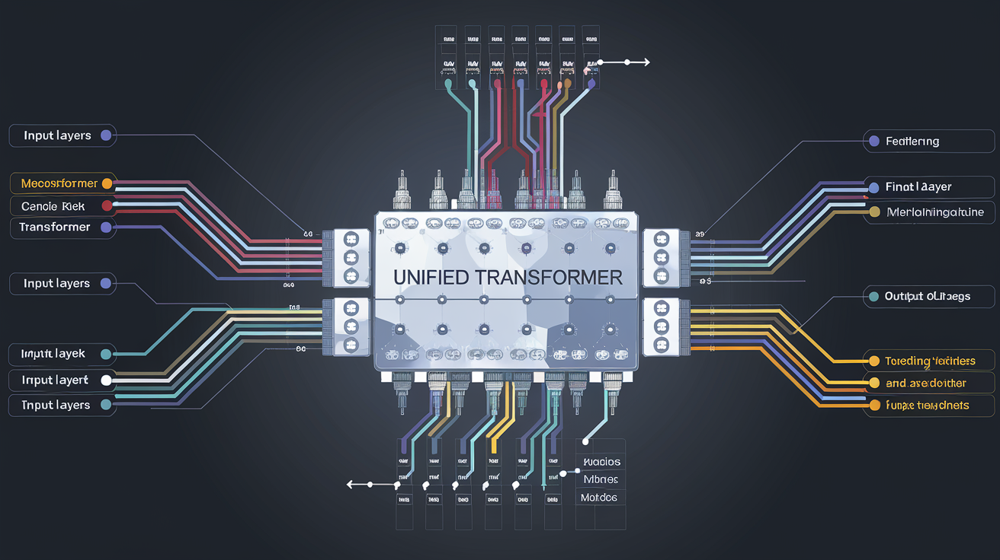

# Awesome Unified Multimodal Models  <!-- omit in toc -->

This is a repository for organizing papers, codes and other resources related to unified multimodal models.

  

#### :thinking: What are unified multimodal models?

Traditional multimodal models can be broadly categorized into two types: **multimodal understanding** and **multimodal generation**.
Unified multimodal models aim to integrate these two tasks within a single framework.
Such models are also referred to as Any-to-Any generation in the community.
These models operate on the principle of multimodal input and multimodal output, enabling them to process and generate content across various modalities seamlessly.

#### :high_brightness: This project is still on-going, pull requests are welcomed!!

If you have any suggestions (missing papers, new papers, or typos), please feel free to edit and pull a request. Just letting us know the title of papers can also be a great contribution to us. You can do this by open issue or contact us directly via email.

#### :star: If you find this repo useful, please star it!!!

<!-- ## Table of Contents <!-- omit in toc -->

<!-- - [Open-source Toolboxes and Foundation Models](#open-source-toolboxes-and-foundation-models)
- [Evaluation Benchmarks and Metrics](#evaluation-benchmarks-and-metrics)
- [Single Model ](#single-model)
- [Multi Experts](#multi-experts)
- [Tokenizer](#tokenizers) -->

### Unified Multimodal Understanding and Generation
+ [Show-o2: Improved Native Unified Multimodal Models](https://arxiv.org/abs/2506.15564) (May. 2025, arXiv)
  
  

+ [Emerging Properties in Unified Multimodal Pretraining](https://arxiv.org/abs/2505.14683) (May. 2025, arXiv)
  
  

+ [UniGen: Enhanced Training & Test-Time Strategies for Unified Multimodal Understanding and Generation](https://arxiv.org/pdf/2505.14682v1) (May. 2025, arXiv)
  

+ [BLIP3-o: A Family of Fully Open Unified Multimodal Models—Architecture, Training and Dataset](https://arxiv.org/pdf/2505.09568v1) (May. 2025, arXiv)
  
  

+ [Ming-Lite-Uni: Advancements in Unified Architecture for Natural Multimodal Interaction](https://arxiv.org/pdf/2505.02471v1) (May. 2025, arXiv)
  
  

+ [Nexus-Gen: A Unified Model for Image Understanding, Generation, and Editing](https://arxiv.org/pdf/2504.21356v1) (Apr. 2025, arXiv)
  

+ [Transfer between Modalities with MetaQueries](https://arxiv.org/abs/2504.06256) (Apr. 2025, arXiv)
  

+ [UniToken: Harmonizing Multimodal Understanding and Generation through Unified Visual Encoding](https://arxiv.org/pdf/2504.04423v1) (Apr. 2025, arXiv)
  
  

+ [Harmonizing Visual Representations for Unified Multimodal Understanding and Generation](https://arxiv.org/pdf/2503.21979v1) (Mar. 2025, arXiv)
  
  

+ [ILLUME+: Illuminating Unified MLLM with Dual Visual Tokenization and Diffusion Refinement](https://arxiv.org/pdf/2504.01934v1) (Apr. 2025, arXiv)
  
  

+ [UGen: Unified Autoregressive Multimodal Model with Progressive Vocabulary Learning](https://arxiv.org/pdf/2503.21193v1) (Mar. 2025, arXiv)
  

+ [OmniMamba: Efficient and Unified Multimodal Understanding and Generation via State Space Models](https://arxiv.org/abs/2503.08686) (Mar. 2025, arXiv)
  
  
+ [MMGen: Unified Multi-modal Image Generation and Understanding in One Go](https://arxiv.org/pdf/2503.20644v1) (Mar. 2025, arXiv)
  
  

+ [MINT: Multi-modal Chain of Thought in Unified Generative Models for Enhanced Image Generation](https://arxiv.org/pdf/2503.01298) (Mar. 2025, arXiv)
  

+ [UniTok: A Unified Tokenizer for Visual Generation and Understanding](https://arxiv.org/abs/2502.20321) (Feb. 2025, arXiv)
  
  

+ [HERMES: A Unified Self-Driving World Model for Simultaneous 3D Scene Understanding and Generation](https://arxiv.org/abs/2501.14729) (Jan. 2025, arXiv)
  

+ [Dual Diffusion for Unified Image Generation and Understanding](https://www.arxiv.org/abs/2501.00289) (Jan. 2025, arXiv)
  

+ [LlamaFusion: Adapting Pretrained Language Models for Multimodal Generation](https://arxiv.org/abs/2412.15188) (Dec. 2024, arXiv)
  

+ [MetaMorph: Multimodal Understanding and Generation via Instruction Tuning](https://arxiv.org/abs/2412.14164v1) (Dec. 2024, arXiv)
  

+ [SynerGen-VL: Towards Synergistic Image Understanding and Generation with Vision Experts and Token Folding](https://arxiv.org/abs/2412.09604) (Dec. 2024, arXiv)
  

+ [Liquid: Language Models are Scalable Multi-modal Generators](https://arxiv.org/abs/2412.04332) (Dec. 2024, arXiv)
  

+ [TokenFlow: Unified Image Tokenizer for Multimodal Understanding and Generation](https://arxiv.org/abs/2412.03069) (Dec. 2024, arXiv)
  

+ [OmniFlow: Any-to-Any Generation with Multi-Modal Rectified Flows](https://arxiv.org/abs/2412.01169) (Dec. 2024, arXiv)
  

+ [Orthus: Autoregressive Interleaved Image-Text Generation with Modality-Specific Heads](https://arxiv.org/abs/2412.00127) (Nov. 2024, arXiv)
  

+ [JetFormer: An Autoregressive Generative Model of Raw Images and Text](https://arxiv.org/abs/2411.19722) (Nov. 2024, arXiv)
  

+ [MUSE-VL: Modeling Unified VLM through Semantic Discrete Encoding](https://www.arxiv.org/abs/2411.17762) (Nov. 2024, arXiv)
  

+ [JanusFlow: Harmonizing Autoregression and Rectified Flow for Unified Multimodal Understanding and Generation](https://arxiv.org/abs/2411.07975) (Nov. 2024, arXiv)
  
  

+ [Spider: Any-to-Many Multimodal LLM](https://arxiv.org/abs/2411.09439) (Nov. 2024, arXiv)
  

+ [MotionGPT-2: A General-Purpose Motion-Language Model for Motion Generation and Understanding](https://arxiv.org/pdf/2410.21747) (Oct. 2024, arXiv)
  

+ [Janus: Decoupling Visual Encoding for Unified Multimodal Understanding and Generation](https://arxiv.org/abs/2410.13848) (Oct. 2024, arXiv)
  
  

+ [PUMA: Empowering Unified MLLM with Multi-granular Visual Generation](https://arxiv.org/abs/2410.13848) (Oct. 2024, arXiv)
  
  

+ [MMAR: Towards Lossless Multi-Modal Auto-Regressive Probabilistic Modeling](https://arxiv.org/abs/2410.10798) (Oct. 2024, arXiv)
  
  
+ [Emu3: Next-Token Prediction is All You Need](https://arxiv.org/abs/2409.18869) (Sep. 2024, arXiv)
  
  

+ [MIO: A Foundation Model on Multimodal Tokens](https://arxiv.org/abs/2409.17692) (Sep. 2024, arXiv)
  

+ [MonoFormer: One Transformer for Both Diffusion and Autoregression](https://arxiv.org/abs/2409.16280) (Sep. 2024, arXiv)
  
  

+ [VILA-U: a Unified Foundation Model Integrating Visual Understanding and Generation](https://arxiv.org/abs/2409.04429) (Sep. 2024, arXiv)
  

+ [Show-o: One Single Transformer to Unify Multimodal Understanding and Generation](https://arxiv.org/abs/2408.12528) (Aug. 2024, arXiv)
  
  

+ [Transfusion: Predict the Next Token and Diffuse Images with One Multi-Modal Model](https://www.arxiv.org/abs/2408.11039) (Aug. 2024, arXiv)
  

+ [ANOLE: An Open, Autoregressive, Native Large Multimodal Models for Interleaved Image-Text Generation](https://arxiv.org/abs/2407.06135) (Jul. 2024, arXiv)
  
  

+ [X-VILA: Cross-Modality Alignment for Large Language Model](https://arxiv.org/abs/2405.19335) (May. 2024, arXiv)
  

+ [Chameleon: Mixed-Modal Early-Fusion Foundation Models](https://arxiv.org/abs/2405.09818) (May 2024, arXiv)
  
  

+ [SEED-X: Multimodal Models with Unified Multi-granularity Comprehension and Generation](https://arxiv.org/abs/2404.14396) (Apr. 2024, arXiv)
  
  

+ [Mini-Gemini: Mining the Potential of Multi-modality Vision Language Models](https://arxiv.org/abs/2403.18814) (Mar. 2024, arXiv)
  
  

+ [AnyGPT: Unified Multimodal LLM with Discrete Sequence Modeling](https://arxiv.org/abs/2402.12226) (Feb. 2024, arXiv)
  
  

+ [World Model on Million-Length Video And Language With Blockwise RingAttention](https://arxiv.org/abs/2402.08268) (Feb. 2024, arXiv)
  
  

+ [Video-LaVIT: Unified Video-Language Pre-training with Decoupled Visual-Motional Tokenization](https://arxiv.org/abs/2402.03161) (Feb. 2024, arXiv)
  
  

+ [MM-Interleaved: Interleaved Image-Text Generative Modeling via Multi-modal Feature Synchronizer](https://arxiv.org/abs/2401.10208) (Jan. 2024, arXiv)
  
  

+ [Unified-IO 2: Scaling Autoregressive Multimodal Models with Vision, Language, Audio, and Action](https://arxiv.org/abs/2312.17172) (Dec. 2023, arXiv)
  
  

+ [Emu2: Generative Multimodal Models are In-Context Learners](https://arxiv.org/abs/2312.13286) (Jul. 2023, CVPR)
  
  

+ [Gemini: A Family of Highly Capable Multimodal Models](https://arxiv.org/abs/2312.11805) (Dec. 2023, arXiv)
  

+ [VL-GPT: A Generative Pre-trained Transformer for Vision and Language Understanding and Generation](https://arxiv.org/abs/2312.09251) (Dec. 2023, arXiv)
  
  

+ [DreamLLM: Synergistic Multimodal Comprehension and Creation](https://arxiv.org/abs/2309.11499) (Dec. 2023, ICLR)
  
  

+ [Making LLaMA SEE and Draw with SEED Tokenizer](https://arxiv.org/abs/2310.01218) (Oct. 2023, ICLR)
  
  
  
+ [NExT-GPT: Any-to-Any Multimodal LLM](https://arxiv.org/abs/2309.05519) (Sep. 2023, ICML)
  
  

+ [LaVIT: Unified Language-Vision Pretraining in LLM with Dynamic Discrete Visual Tokenization](https://arxiv.org/abs/2309.04669) (Sep. 2023, ICLR)
  
  

+ [Planting a SEED of Vision in Large Language Model](https://arxiv.org/abs/2307.08041) (Jul. 2023, arXiv)
  
  
  
+ [Emu: Generative Pretraining in Multimodality](https://arxiv.org/abs/2307.05222) (Jul. 2023, ICLR)
  
  

+ [CoDi: Any-to-Any Generation via Composable Diffusion](https://arxiv.org/abs/2305.11846) (May. 2023, NeurIPS)
  
  

+ [Multimodal unified attention networks for vision-and-language interactions](https://arxiv.org/abs/1908.04107) (Aug. 2019)
  

+ [UniMuMo: Unified Text, Music, and Motion Generation](https://arxiv.org/abs/2410.04534) (Oct. 2024, arXiv)
  
  
  

+ [MedViLaM: A multimodal large language model with advanced generalizability and explainability for medical data understanding and generation](https://arxiv.org/pdf/2409.19684) (Oct. 2024, arXiv)
  

+ [ShowHowTo: Generating Scene-Conditioned Step-by-Step Visual Instructions](https://arxiv.org/pdf/2412.01987) (Dec. 2024, arXiv)
  

<!-- ### Multi Experts
  + [TaxaBind: A Unified Embedding Space for Ecological Applications](https://arxiv.org/pdf/2411.00683) (Nov. 2024, arXiv)
  
  
   -->

<!-- ### Tokenizer
  + [Cosmos Tokenizer: A suite of image and video neural tokenizers](https://developer.nvidia.com/blog/state-of-the-art-multimodal-generative-ai-model-development-with-nvidia-nemo/) (Nov. 2024, arXiv)
  
  
   -->

## Acknowledgements

This template is provided by [Awesome-Video-Diffusion](https://github.com/showlab/Awesome-Video-Diffusion) and [Awesome-MLLM-Hallucination](https://github.com/showlab/Awesome-MLLM-Hallucination).
